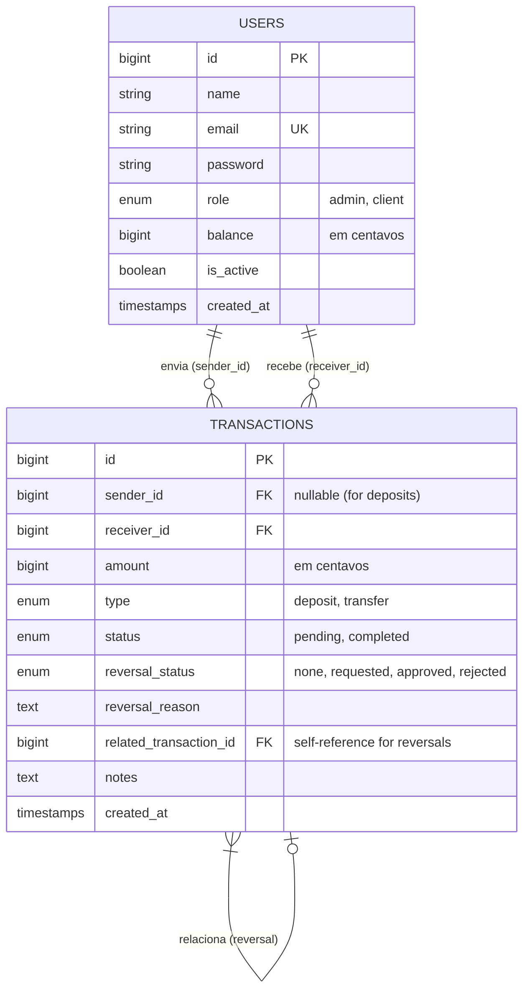

# Wallet cobuccio

Este projeto é um sistema de Carteira (Wallet) e Painel Administrativo, desenvolvido com foco em **Clean Architecture**, **SOLID** e uma interface de usuário moderna e premium.

## 🚀 Tecnologias e Stack

* **Backend:** [Laravel 12](https://laravel.com/) (PHP)
* **Frontend Reativo:** [Livewire 3](https://livewire.laravel.com/)
* **Estilização:** [Tailwind CSS v4](https://tailwindcss.com/)
* **Banco de Dados:** MySQL 8.0
* **Cache & Filas:** Redis
* **Infraestrutura Local:** Docker (Laravel Sail modificado)

## 🏗️ Arquitetura e Decisões de Design

O projeto foge do padrão MVC simples para adotar camadas bem definidas de abstração, garantindo manutenção a longo prazo, alta testabilidade e código sem acoplamentos fortes:

1. **Repository Pattern (`App\Repositories` e `App\Contracts`)**: 
   A separação rigorosa da camada de acesso aos dados. Os componentes (Livewire) e os Serviços nunca acessam o banco ou os Models do Eloquent diretamente. Usamos interfaces. Isso significa que podemos mudar o banco de dados no futuro sem reescrever a lógica principal.
   
2. **Service Layer (`App\Services`)**:
   Regras de negócio isoladas. A criação de um usuário, validações complexas e operações ocorrem aqui. Isso permite que a mesma lógica seja acionada por uma interface Web, por uma API, ou por comandos de console sem replicação de código.

3. **Componentização Extrema (Custom Blade Components)**:
   A UI foi meticulosamente recortada em pequenos componentes de Blade (`<x-modal>`, `<x-input-group>`, `<x-admin.stat-card>`). Isso seca o código ("DRY"), organiza o Tailwind CSS – que pode ficar muito denso – em pontos únicos de manutenção, resultando em "views" como a Dashboard contendo raríssimas tags genéricas (`<div>`, `<span>`).

4. **Pivotando do Supabase para Nativo**:
   O projeto chegou a possuir integração profunda com as SDKs e Banco de Dados Supabase. Em prol de maior simplicidade e controle total da stack local pelo Laravel Eloquent, todas as referências ao Supabase foram defenestradas. Temos um produto 100% autossuficiente.

## 🔒 Segurança e Autenticação

O sistema de autenticação foi construído do zero utilizando Livewire, priorizando a segurança e a experiência do usuário:

*   **Rate Limiting (Throttle):** Proteção contra ataques de força bruta no login. O sistema limita 5 tentativas por e-mail/IP em um determinado intervalo de tempo antes de bloquear novas tentativas temporariamente.
*   **Controle de Estado do Usuário:** Somente usuários com `is_active = true` podem autenticar. Se um administrador desativar uma conta no painel, o acesso é revogado imediatamente.
*   **Proteção de Sessão:** Implementação de `session()->regenerate()` após login e cadastro para prevenir ataques de *Session Fixation*.
*   **Políticas de Senha Forte:** Implementação de regras rigorosas para criação de senhas pelos usuários:
    *   Mínimo de 8 caracteres.
    *   Obrigatório pelo menos uma letra maiúscula e uma minúscula.
    *   Obrigatório pelo menos um número.
    *   Verificação contra senhas vazadas (Data Leaks) no registro.
*   **Privilégio Administrativo:** Administradores possuem autoridade para definir senhas simplificadas ao criar ou editar usuários manualmente no dashboard, ignorando as restrições de complexidade impostas aos clientes finais.
*   **Localização de Alertas:** Todas as mensagens de erro de validação de segurança foram traduzidas para o português brasileiro.
*   **Prevenção contra CSRF:** Proteção nativa presente em todos os formulários e solicitações Livewire.

## 🛠️ Como Executar o Projeto

A arquitetura de desenvolvimento adota uma abordagem **Híbrida de Alta Performance**, onde Serviços de Infra (Banco e Redis) utilizam Docker, mas Ferramentas de Compilação (PHP, Vite) usam o Host Nativo evadindo lentidão de sistemas de arquivos em disco sincronizado.

### Requisitos Prévios
*   [Docker Desktop](https://www.docker.com/) rodando no sistema.
*   [PHP](https://windows.php.net/download/) instalado e no Path do Windows/Mac/Linux.
*   [Node.js](https://nodejs.org/) & NPM.
*   [Composer](https://getcomposer.org/).

### 1. Inicialização Base

```bash
# Instale as dependências (PHP e Node)
composer install
npm install

# Prepare o ambiente
cp .env.example .env
php artisan key:generate
```

### 2. Infraestrutura (Docker)

Suba o servidor do MySQL, do Redis e Mailpit em background usando o docker compose nativo da pasta.

```bash
docker compose up -d mysql redis mailpit
```

Uma vez com os containers UP, dispare as migrações pra construir o esquema:

```bash
php artisan migrate
```

*(O arquivo .env já está devidamente configurado para apontar `DB_HOST` para `127.0.0.1`, acessando o DB portificado pelo Docker e não a rede interna dos containers).*

### 3. Rodando o Ambiente de Desenvolvimento

Deixe dois terminais abertos simultaneamente em sua IDE para total capacidade "Hot-Reload":

**Terminal 1 (Laravel Server):**
```bash
php artisan serve
```

**Terminal 2 (Motor de Assets):**
```bash
npm run dev
```

Abra em seu navegador em `http://localhost:8000`
## 👥 Perfis e Permissões

O sistema implementa **RBAC (Role-Based Access Control)** via Middleware customizado (`EnsureUserHasRole`), dividindo a experiência em duas áreas isoladas:

*   **Administrador (`admin`):** Acesso total ao Dashboard de gerenciamento de usuários, estatísticas globais do sistema, ativação/desativação de contas e alteração de perfis.
*   **Cliente (`client`):** Acesso exclusivo à área de "Minha Carteira", onde pode gerenciar seu saldo, realizar depósitos e transferências.
*   **Redirecionamento Inteligente:** O sistema possui uma rota de entrada única (`/dashboard`) que identifica o perfil do usuário logado e o catapulta automaticamente para a visão correta de sua função.

## 💰 Funcionalidades Financeiras

O motor financeiro foi desenhado para simular um ambiente bancário real com alta precisão e segurança:

### 📥 Depósitos (Simulação PIX)
A entrada de fundos no sistema utiliza um fluxo de UX inspirado em aplicativos de bancos digitais modernos:
1.  **Modal em 2 Etapas:** O usuário informa o valor desejado (com validação em tempo real).
2.  **Geração de Chave:** O sistema gera um **PIX Copia e Cola** fictício (Hash baseada em UUID) e um QR Code visual.
3.  **Copia e Cola Inteligente:** Um botão interativo com feedback visual ("Copiado!") agiliza o processo de simulação.
4.  **Simulação de Confirmação:** Um gatilho manual permite "confirmar" o pagamento do App do banco para que o saldo entre na carteira instantaneamente.

### 🛡️ Integridade e Segurança das Transações
*   **Precisão Monetária:** Todos os valores são processados e armazenados em **Centavos (BigInteger)**. Isso elimina erros clássicos de arredondamento de ponto flutuante em operações financeiras.
*   **Atomicidade (Transactions):** O registro de uma transação e a atualização do saldo do usuário ocorrem dentro de uma **Database Transaction**. Se um dos passos falhar, o banco sofre um `rollback` automático, impedindo que o dinheiro suma ou que um saldo seja gerado sem registro no extrato.
*   **Histórico Imutável:** Cada movimentação gera um registro único na tabela `transactions`, vinculado ao usuário e com selo de data/hora (timestamps), garantindo auditoria futura.

## 📊 Histórico e Governança de Transações

O sistema implementa uma camada de visibilidade e controle granular sobre o fluxo financeiro:

### 📱 Visão do Cliente (Meu Extrato)
*   **Segmentação Inteligente:** O usuário visualiza apenas as movimentações que lhe pertencem (seus depósitos e suas transferências como remetente ou destinatário).
*   **Identificação Visual (Color-Coded):**
    *   **Entradas (+):** Depósitos PIX e Transferências Recebidas em **Verde**.
    *   **Saídas (-):** Transferências Enviadas em **Vermelho** para facilitar o controle de gastos.
*   **Paginação:** Extrato otimizado com carregamento paginado para performance em contas com alto volume.

### 👑 Visão Administrativa (Controle Global)
*   **Audit Trail Completo:** O administrador possui uma tabela mestre com TODAS as transações do sistema em tempo real.
*   **Identificação de Agentes:** Visualização clara de quem é a "Origem" (Remetente) e o "Destino" (Recebedor) de cada centavo.
*   **Rastreamento de Depósitos:** Identificação de entradas via "Sistema (PIX)".

## 🔄 Sistema de Estorno sob Análise

Para garantir a reversibilidade e segurança contra erros humanos ou fraudes, implementamos um workflow de estorno:

1.  **Solicitação de Motivo:** O cliente pode solicitar o estorno de qualquer transferência enviada. O sistema exige um **Motivo Detalhado** (mínimo de 10 caracteres).
2.  **Estado de Pendência:** Durante a análise, a transação original é marcada como "Estorno em Análise", impedindo novas solicitações.
3.  **Painel de Prioridade Admin:** Solicitações pendentes aparecem com **Destaque Visual (Badge Laranja e Animação Pulse)** no topo da dashboard do Admin.
4.  **Análise de Justificativa:** O Admin visualiza o motivo escrito pelo usuário diretamente no card de alerta.
5.  **Aprovação/Reprovação:**
    *   **Aprovação:** O sistema realiza o *Rollback* financeiro (debitando do destino e creditando na origem) e gera uma **nova transação de estorno** vinculada à original para manter o livro-razão (ledger) consistente.
    *   **Rejeição:** A transação original volta ao estado normal de "Concluído", e o cliente é notificado visualmente no extrato.

## 🏗️ Modelagem de Dados (ER Diagram)

A estrutura do banco de dados foi projetada para consistência e rastreabilidade:


